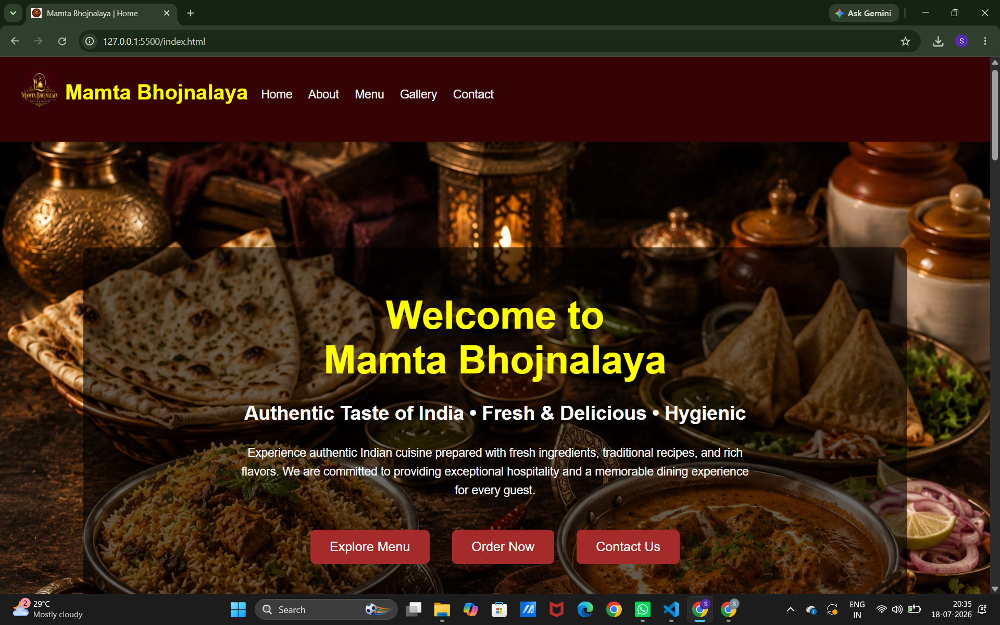
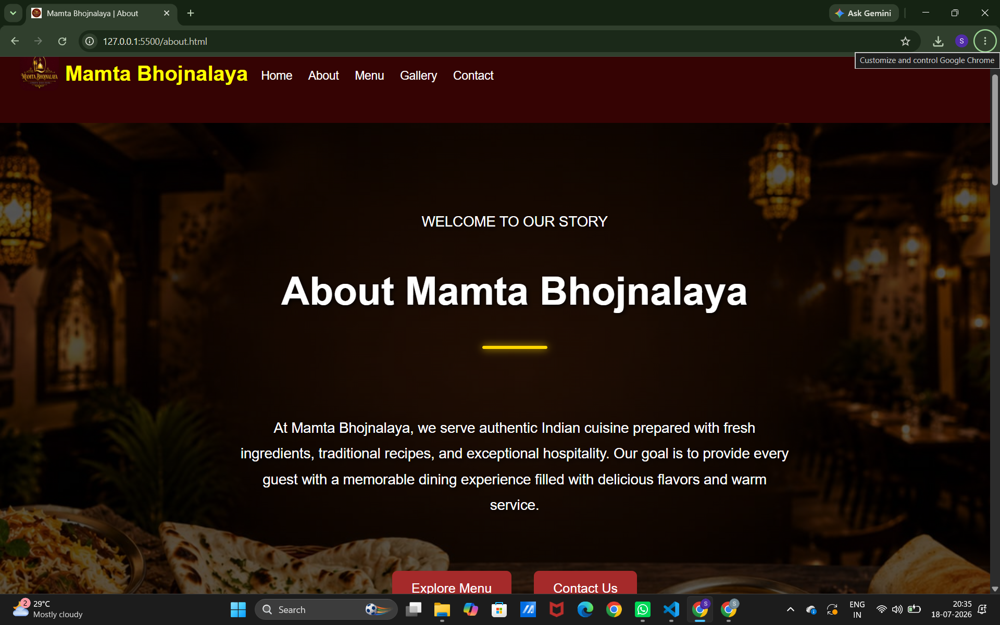
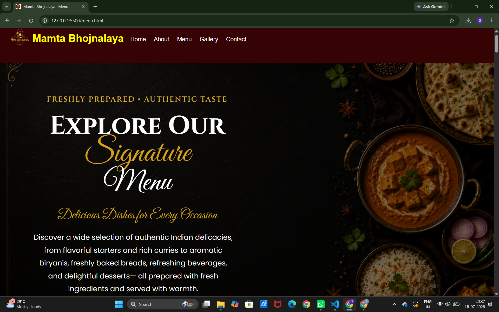
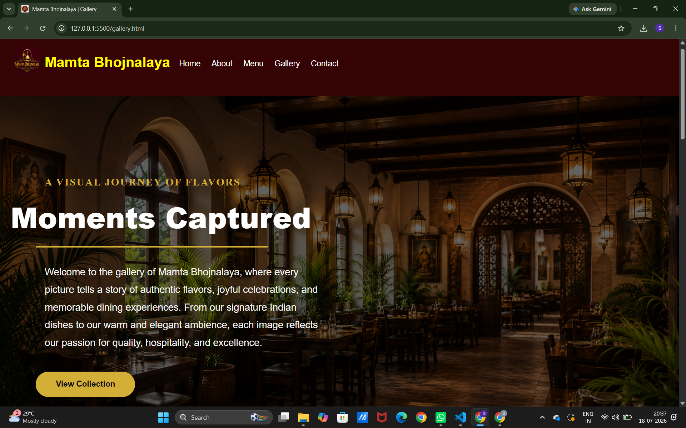
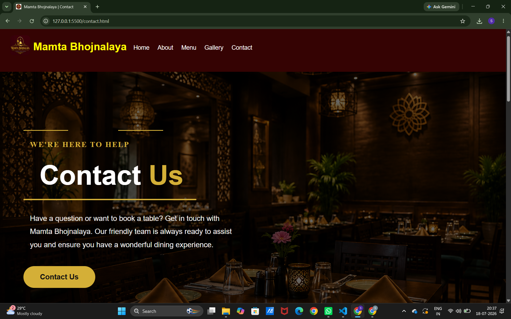

# 🍽️ Mamta Bhojnalaya – Responsive Restaurant Website

## 🌿 Introduction

Mamta Bhojnalaya is a responsive restaurant website developed to provide an engaging online presence for a traditional Indian restaurant. The website combines an attractive design with easy navigation, allowing visitors to explore the restaurant, browse the menu, view the gallery, and find contact information effortlessly.

This project was created as part of the **Infobharat Interns Web Development Internship** to demonstrate front-end web development skills using modern web technologies.

---

## 🎯 Project Goals

* Develop a responsive and user-friendly website.
* Present restaurant information in an attractive way.
* Ensure compatibility across multiple devices.
* Improve front-end development skills through a real-world project.

---

## ✨ Website Features

* Responsive Navigation Menu
* Attractive Home Page
* About Us Section
* Categorized Food Menu
* Restaurant Image Gallery
* Contact Information
* Google Maps Location
* Customer Reviews
* Social Media Links
* Mobile-Friendly Layout

---

## 🛠️ Technologies Used

* HTML5
* CSS3
* JavaScript
* Font Awesome
* Google Maps Embed

---

## 📁 Project Structure

```text
Mamta-Bhojnalaya/
│
├── index.html
├── about.html
├── menu.html
├── gallery.html
├── contact.html
│
├── css/
│   └── style.css
│
├── js/
│   └── script.js
│
├── images/
│
├── screenshots/
│   ├── home.png
│   ├── about.png
│   ├── menu.png
│   ├── gallery.png
│   └── contact.png
│
└── README.md
```

---

## 🚀 Getting Started

1. Clone or download this repository.
2. Open the project folder.
3. Launch **index.html** using any modern web browser.
4. Explore all the pages using the navigation menu.

---

## 📱 Responsive Design

The website has been tested on:

* Desktop
* Laptop
* Tablet
* Mobile Devices

---

## 📸 Website Screenshots

### Home



### About



### Menu



### Gallery



### Contact



---

## 📚 Skills Applied

* Semantic HTML5
* CSS Styling and Layout
* Responsive Web Design
* JavaScript Basics
* Website Organization
* GitHub Project Hosting

---

## 🌱 Future Improvements

* Online Food Ordering
* Table Reservation System
* Search Feature
* Dark Mode
* Customer Login

---

## 👩‍💻 Developed By

**Sasikala Karri**

**Project:** Mamta Bhojnalaya – Responsive Restaurant Website

**Organization:** Infobharat Interns

**Role:** Web Development Intern


---

## 🤝 Acknowledgement

I sincerely thank **Infobharat Interns** for providing this internship opportunity and encouraging practical learning through real-world web development projects.
